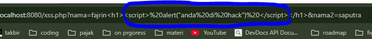
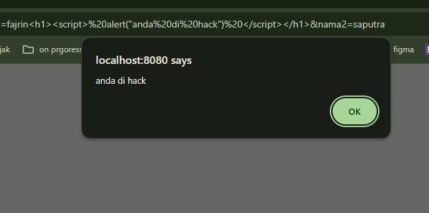
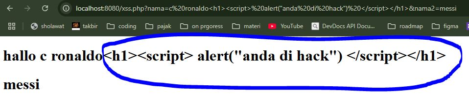

# XSS (Cross-Site Scripting)

XSS adalah sebuah celah keamanan yang bisa di salah gunakan untuk melakukan manipulasi / menambahkan script pada paremeter yang di kirimkan oleh user

biasa nya menggunakan script javascript sehingga akan merender script tersebut yang di mana bertujuan jahat terhadap web kita 
ini juga dapat atau biasanya di gunakan untuk mencuri session pada web kita dan ini sangat berbahaya bagi website kita


### ini contoh script php


```php

$nama = $_GET["nama"];
$nama_belakang = $_GET["nama2"];


<!DOCTYPE html>
<html lang="en">

<head>
   <meta charset="UTF-8">
   <meta name="viewport" content="width=device-width, initial-scale=1.0">
   <title>Document</title>
</head>

<body>

   <h1> hallo <?= $nama ?> </h1>
   <h1><?= $nama_belakang ?></h1>
</body>

</html>


```

***kita memasukan script js dalam contoh ini kita mengirim function alert***

;


***dan ini adalah hasil nya***

;


dari contoh di atas kita bisa lihat , bahwa script javacript yang di kirim dapat di render, dan menggangu dari website kita, karena script nya tidak kita inginkan


## mengatasi xss

untuk mengatasi nya php memiliki function Html spesial carakter  
```php
htmlspecialchars( );
```

dimana function ini akan mengencode setiap / apapun yang di masukan ke dalam parameter get menjadi teks sebagai mana mestinya sehingga script yang tidak di inginkan tidak dapat berjalan


```php

$nama = htmlspecialchars($_GET["nama"]);
$nama_belakang = $_GET["nama2"];


<!DOCTYPE html>
<html lang="en">

<head>
   <meta charset="UTF-8">
   <meta name="viewport" content="width=device-width, initial-scale=1.0">
   <title>Document</title>
</head>

<body>

   <h1> hallo <?= $nama ?> </h1>
   <h1><?= $nama_belakang ?></h1>
</body>

</html>


```

***setelah kita menggunakan htmlspecialchart***


ketika kita menggunaakn htmlspesialchars, maka setiap script yang di tulis seluruh karakter nya akan di render seperti string / teks biasa 

jadi kita bisa menggunakan htmlspecialchar di setiap inputan / parameter yang di kirimkan oleh user
ini berguna untuk mencegah xss (cross-site scripting)