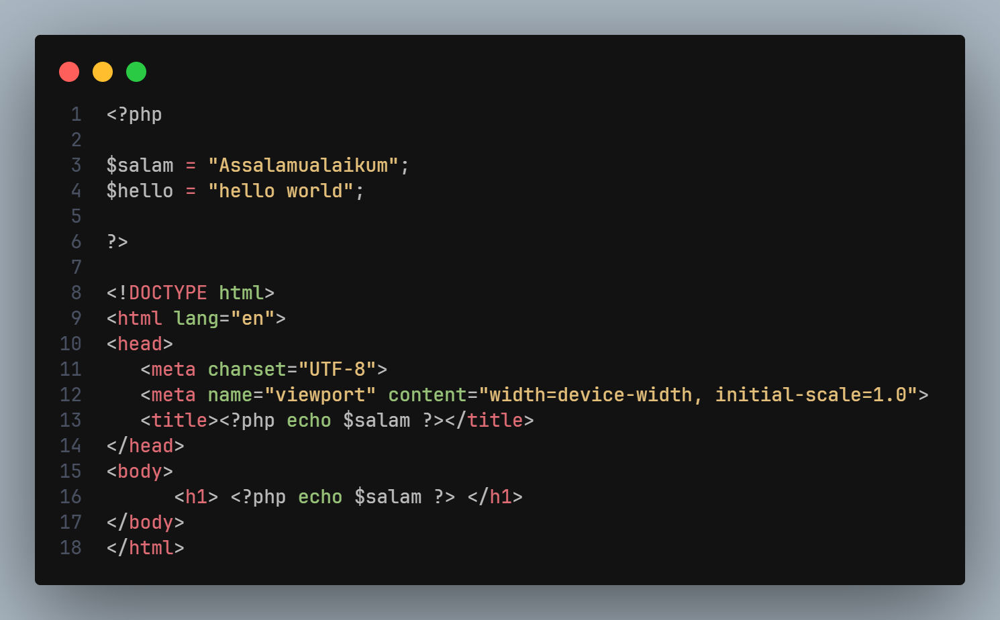
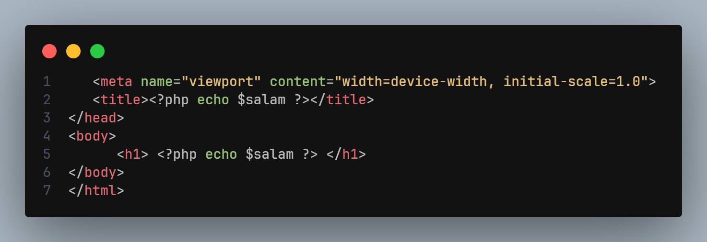
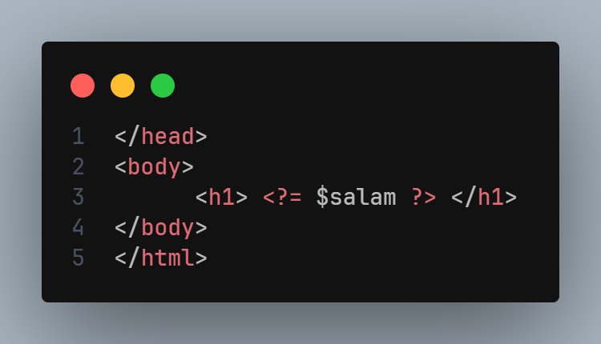

# intergrasi dengan HTML

- PHP secara default terintergrasi dengan baik dengan html
- dengan kombinasi bahasa pemrograman php dan html kita dapat dengan baik membuat web yang dinamis
- saat kita menggunakan php di dalam html,kita bisa menggunakan beberapa cara menulis tag
   1. <?php  #kode kita ?>
   2. <? #kode kita ?>
artinya di dalam tag tersebut kita bisa menulis kode php, dan di luar nya kita bisa menulis kode HTML seperti biasa

dalam menulis code php, jika di dalam nya terdapat kode selain php, maka wajib gunakan tag penutup nya


## contoh kode



## contoh tampilan web


## sourcode pada html
saat kita menggunakan php , code kita tidak tampil di sourcode jadi lebih aman, yang tampil hanya code html nya saja


## kode <?=

terkadang saat kita menulis php di dalam kode html kita hanya menulis untuk menampilkan nilai dari suatu variabel saja 

contoh
kita menggunakan 
```html

<h1>  <?php echo $data ?>  </h1>


```




jika kode nya sederhana hanya ingin menampilkan, atau menggunakan echo , kita bisa menggunakan shortcut / alternatif yang lebih simpel yaitu dengan tag <?= ?>


### berikut kode nya <?=


dari contoh di atas kita bisa menggunakan alternatif tag seperti di atas , jika hanya menulis kode php sederhana


## tidak hanya HTML
meskipun secara default terintegrasi dengan html, bukan bearti hanya html saja, dalam pembuatan web dinamis
php juga mampu mengembalikan konten apapun seperti, javascript, css, image, video dan lainya