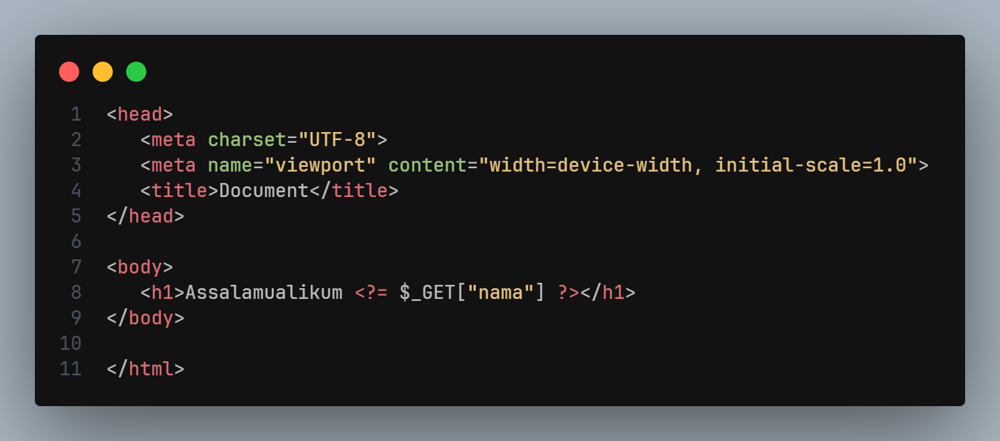
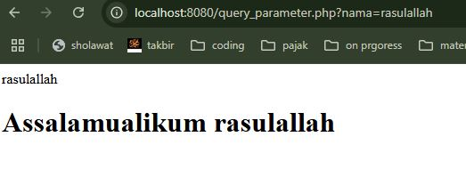
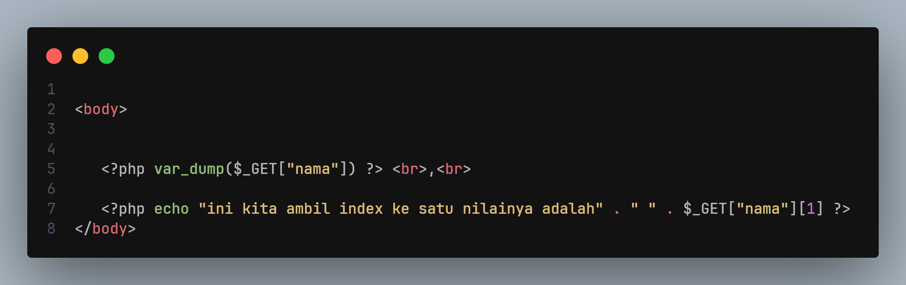
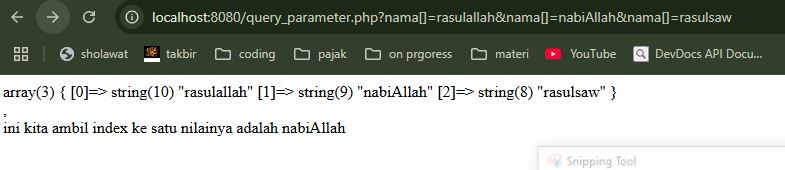
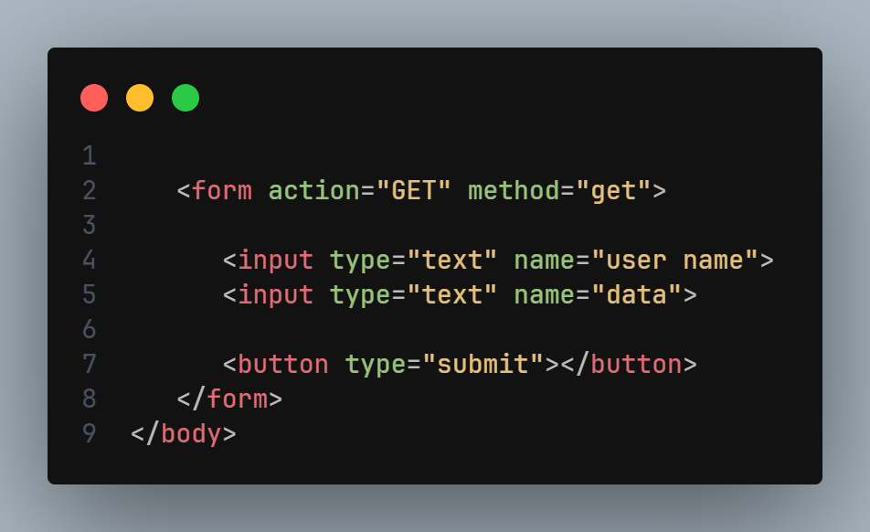

# Query Parameter

- saat kita mengakses web kita akan menggunakan URL, di dalama nya terdapat bagian bagian seperti, domain, path .query paramater dan yang lainya

- query parameter adalah informasi tambahan yang di kirim oleh client, kepada server melalui url

- di php query parameter ini akan di simpan di dalam variabel global, dengan nama `$_GET` dalam bemtuk array

## cara menambahkan query parameter pada url
cara cukup menambahkan  `?` lalu di ikut dengan `key = value`
contoh url ny
`localhost/aplikasi.php?nabi=rasulallah`

dari contoh di atas query parameter nya adalah key ny adalah nabi, dan value nya adalah rasulallah

## $_GET
dari contoh di atas jika kita ingin menangkap / menampung nya
kita cukup gunakan variabel global $_GET['key ny']

 $_GET['nama'], maka isi nya adalah 'rasulallah'

- perlu di ingat query parameter adalah data  yang di kirim dari client , jadi pastikan kita cek dulu apakah data nya ada, jangan sampai kita melakukan logic program tapi data nya tidak ada

contoh kode query parameter

tampilan pada browser

## multiple query parameter
kita juga bisa menggunakan lebih dari satu queri parameter pada url atau multiple
`localhost/aplikasi.php?nabi=rasulallah&tuhan=allah`

bisa kita ulangi dengn menambah tanda `&` dan kita sertakan juga key dan value nya

## query parameter array

secara default queri parameter dalam bentuk key dan value, 
jadi jika kita menimpa dengan value key sama, maka akan menimpa hasil yang sebelumnya yang di ambil contoh

`localhost/aplikasi.php?nabi=rasulallah?nabi=ya rasulallah`

saat kita menampung variabe $_GET["nama"]
maka value atau nilai yang diambil adalah "ya rasulalla"; 
lalu bagai mana jika kita ingin mengambil semua nya? bisa di lakukan dengan membuat query parameter nya menjadi seperti array

caranya 
cukup dengan menambhkan `[]` pada key nya 

`localhost/aplikasi.php?nabi[]=rasulallah?nabi[]=ya rasulallah`;

maka saat kita menampung variabel $_GET["nama"], semua nilai nya akan diambil
berikut kode nya

dan ini adalah hasil nya beserta tampilan url nya

## tambahan

segala sesuatu tentang queri parameter akan tersimpan di variabel global $_GET,
jadi jika kita menulis di url akan masuk di $_GET, begitupun jika kita menggunakan form dengan action method GET
maka akan masuk juga di variabel $_GET, dimana untuk key nya adalan nama / name pada selector nya

contoh

jadi cara mengambil nya 
$_GET["user name"], dan untuk data $_GET["data ]